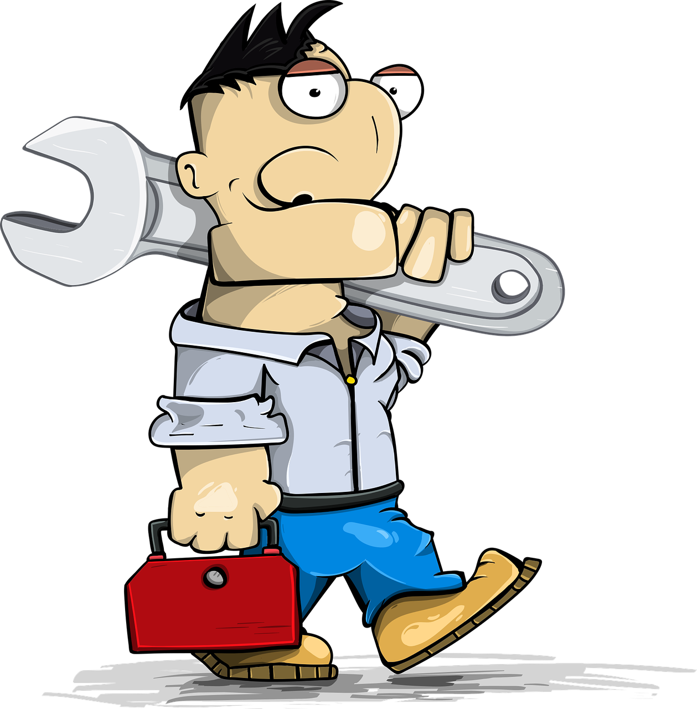

# 

<h4 style="color:Orange;">Servicios</h4>
<!-- [ :material-pencil:](Estudios){ .md-button .md-button--primary } -->
[:material-whatsapp:](https://wa.me/034600366211/?text= Solicito presupuesto para una instalacion de autoconsumo en .... Mi factura de luz mensual es de (€) ... ){ .md-button  }
[:material-phone:](tel:+34-600-366-211){ .md-button  }
[:material-email:](mailto:admin@asolear.es?Subject=Autoconsumo con Energias Renovables){ .md-button }

???+ " Analisis de viabilidad (gratuito) [Personalizar ](../Estudios){ .md-button .md-button--primary }"
    { width="100" align=right }
    Se analizan las posibilidades de nuestro edificio, el presupuesto de lo que podría costar la instalación y cuánto nos podríamos ahorrar en nuestro caso concreto. Con los datos de localizacion y un perfil de carga tipo se propone la inversion optima.

???+ " Un estudio de viabilidad "
    { width="100" align=left }
    Se hace el analisis de viabilidad con el perfil de carga especifico y se genera un documento firmado por un tecnico competente.
    
    Para esto,se utiliza su perfil de carga del ano anterior, por lo que necesitaremos los datos de sus facturas eléctricas, a fin de poder optimizar sus balances energeticos, la potencia contratada y correccion del factor de potencia si procede.

???+ "La propia instalación "
    { width="100" align=right }
    La propia instalación teniendo en cuenta
    la normativa energética y de
    seguridad de las instalaciones
???+ " Legalizacion "
    { width="100" align=left }
    El registro ante la comunidad autónoma y
    las notificaciones que corresponda ante la
    distribuidora de electricida
???+ " Instaladores"
    { width="100" align=left }
    Colaboramos con instaladores  que necesiten ayuda para la tramitacion de las solicitud de las ayudas para instalaciones de autoconsumo.
<!-- 

???+ "  Manitas"
    { width="100" align=right }

    Puede acceder a las ayudas si se ha instalado usted los paneles, siempre  que las facturas estén a nombre del beneficario de las ayudas , que tengan fecha posterior al 30 de junio de 2021 y cumpla la normativa de seguridad de las instalaciones.
     -->

<!-- [ :material-pencil:](Estudios){ .md-button .md-button--primary } -->
[:material-whatsapp:](https://wa.me/034600366211/?text= Solicito presupuesto para una instalacion de autoconsumo en .... Mi factura de luz mensual es de (€) ... ){ .md-button  }
[:material-phone:](tel:+34-600-366-211){ .md-button  }
[:material-email:](mailto:admin@asolear.es?Subject=Autoconsumo con Energias Renovables){ .md-button }

