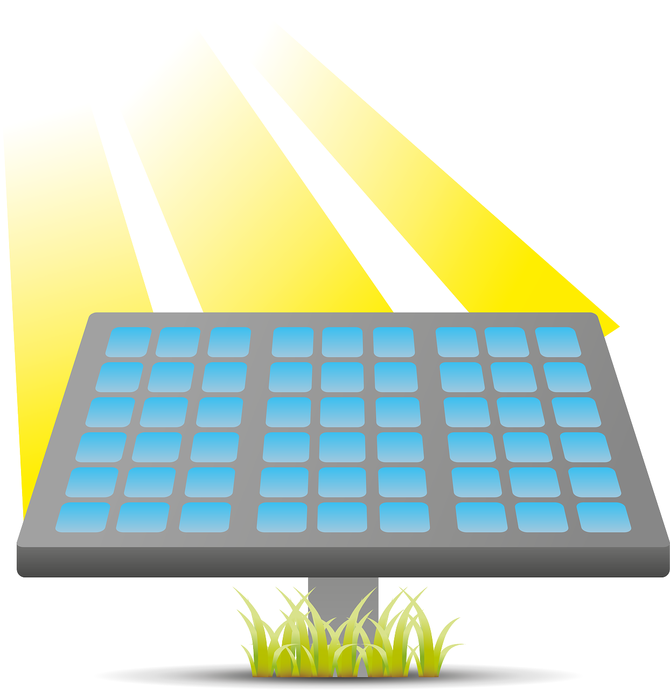
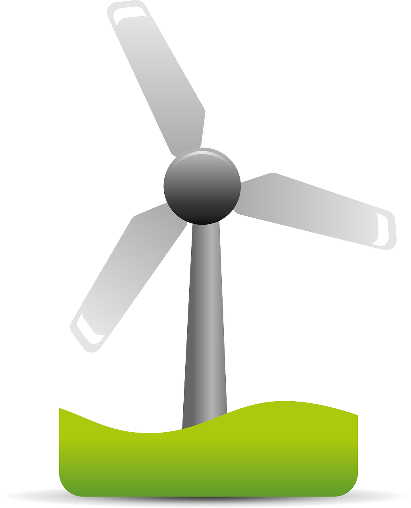
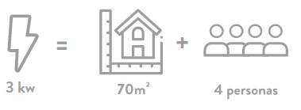
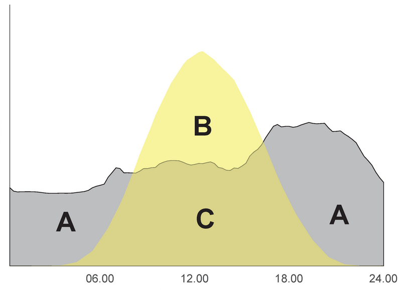

# 

[:fontawesome-solid-solar-panel: :material-wind-turbine::fontawesome-solid-temperature-high: ](/){ .md-button .md-button--primary }
[:fontawesome-solid-euro-sign: Estudio  ](/Estudios){ .md-button  }

<!-- 
[{ width="40"  }](Estudios#aa){ .ms-button  }
[{ width="40"  }](Estudios){ .ms-button  }
[{ width="40"  }](Estudios){ .ms-button  }
[{ width="40"  }](Estudios){ .ms-button  } -->

<!-- [ :material-pencil:](/Estudios){ .md-button .md-button--primary } -->
<h4 style="color:Orange;">Renovables. Viabilidad, costes e incentivos.</h4>

<residencial>
=== "  Hogar "
    ???+ warning ":fontawesome-solid-solar-panel: (FV) Ejemplo: Hogar de 70 m2 donde conviven cuatro personas con un consumo anual estimado de unos 4.000 kWh "
        ??? question " ¿Que se instala?  :fontawesome-solid-solar-panel: FV  3 kWp"
            === ":fontawesome-solid-solar-panel:  3 kWp  "
                { width="200" align=left }
                En la actualidad, un sistema de 3.2 kW (8 paneles de 400 W) puede cubrir la mayoría de las necesidades de iluminación y consumo eléctrico de un hogar de cuatro miembros y una superficie de setenta metros cuadrados.        
                
            === ":fontawesome-solid-battery-half: 0 kWh "
                NO sale a cuenta instalar baterias.

            === ":fontawesome-solid-fan: 0 kW "
                No se considera rentable por la baja fuerza del viento en la zona

        ??? question " ¿Cuánto cuesta ? :fontawesome-regular-money-bill-alt: 4.500€"
            === ":fontawesome-solid-solar-panel:  13.504€  "
                { width="40" align=right }
                Instala un sistema solar fotovoltaica de 3 kW con una inversión de 4.500€.
            === ":fontawesome-solid-battery-half: 0€ "
            === ":fontawesome-solid-fan: 0€ "

        ??? question " ¿De cuánto es la Ayuda?, :material-piggy-bank: 1.800 € (40%) "
            === ":fontawesome-solid-solar-panel:  2.700 €  "
                El incentivo que podría corresponderle es de 1.800€ (600 euros por kW), con lo que el coste neto es de 2700 €.
            === ":fontawesome-solid-battery-half: 0€ "
            === ":fontawesome-solid-fan: 0€ "

        ??? question " ¿En cuánto tiempo se amortiza ?, 4-8 años "
            { width="200" align=left }
            La amortización en una instalación en autoconsumo estaría
            entre seis y diez años (sin ayudas), ya que depende  del uso que se haga de la energía, de su capacidad para ajustar su consumo (A,gris en la figura) a las horas de sol (B,amarillo en la figura), de los precios a que se hubiera comprado lo autoconsumido,(C en la figura) y vendido el excedente,(B en la figura). 

    ???+ warning ":fontawesome-solid-solar-panel: (ST) Ejemplo: ACS para un Hogar de 3 dormitorios con un consumo 180 litros/día y nueva instalacion de suelo radiante."
        ??? question " ¿Que se instala?  :fontawesome-solid-solar-panel: ST 8m^2^; 5.6 kW"
            === ":fontawesome-solid-solar-panel:  5.6 kWp  "
                Segun RITE.        
                
  

        ??? question " ¿Cuánto cuesta ? :fontawesome-regular-money-bill-alt: 12.500€"
            === ":fontawesome-solid-solar-panel:  7.000€  "
                { width="40" align=right }
                Instala un sistema solar ACS con una superficie de captacion de 8m^2^ con una inversión de 5.900€.
            === "Suerlo raciante  5.500€  "
                { width="40" align=right }
                Instala un sistema calefaccion por suelo radiante con una inversión de 5.500€.

        ??? question " ¿De cuánto es la Ayuda?, :material-piggy-bank: 5160 € (41%) "
            === ":fontawesome-solid-solar-panel:  1.800 €  "
                Ayuda a la generacion de 1.800 €  
            === ":fontawesome-solid-solar-panel: Distribucion 3.360 €  "
                Ayuda a la distribucion de 3.360   €  

        ??? question " ¿En cuánto tiempo se amortiza ?, 1-2 años "
            La amortización en una instalación  estaría
            entre cuatro y seis anos (sin ayudas), ya que depende  del uso que se haga de la energía, de su capacidad para ajustar su consumo .

=== "  :fontawesome-solid-industry:  Empresa "
    ???+ warning ":fontawesome-solid-solar-panel: (FV) Ejm.: Fabrica de pelets en una localidad de 3.500 habitantes, con un consumo anual de 10.000 kWh "

        ??? question " ¿Que se instala? :fontawesome-solid-solar-panel:  8 kWp + :fontawesome-solid-battery-half: 4 kWh "
            === ":fontawesome-solid-solar-panel:  8 kWp  "
                Superficie de 35 m^2^ (20 x Panel Solar fotovoltaico de 400 W.) 
            === ":fontawesome-solid-battery-half: 4 kWh "
                Un almacenamiento de 4 kWh ayudara a reducir los picos puntuales de consumo y por tanto la potencia contratada.
            === ":fontawesome-solid-fan: 0 kW "
                No se considera rentable

        ??? question " ¿Cuánto cuesta ? 21.540€"
            === ":fontawesome-solid-solar-panel:  13.504€  "
                Generador Solar fotovoltaica de 8 kWp 
                (20 paneles de 400 W. sobre marquesina) que pueden cubrir la mayoría de las necesidades de consumo eléctrico.
            === ":fontawesome-solid-battery-half: 8.000€ "
                Un almacenamiento de 4 kWh ayudara a reducir los picos puntuales de consumo y por tanto la potencia contratada.
            === ":fontawesome-solid-fan: 0€ "
                No se considera rentable

        ??? question  " ¿Que Incentivos tiene?, :material-piggy-bank: 8.712 € (p. 1 y 2) "
            === ":fontawesome-solid-solar-panel:  6.752€  "
                6.752€ (0.5*1.688 €/kW) para la parte fotovoltaica contando la ayuda por la instalacion de marquesina y por estar ubicado en localidad de 3500 hab.
            === ":fontawesome-solid-battery-half: 1.960€ "
                * 1.960€ (0.7*700 €/kWh) a la capacidad de almacenamiento
            === ":fontawesome-solid-fan: 0€ "

        ??? question " ¿En cuánto tiempo se amortiza ?, 4-8 años "
            { width="200" align=left }
            La amortización en una instalación en autoconsumo estaría
            entre seis y diez años (sin ayudas), ya que depende  del uso que se haga de la energía, de su capacidad para ajustar su consumo (A,gris en la figura) a las horas de sol (B,amarillo en la figura), de los precios a que se hubiera comprado lo autoconsumido,(C en la figura) y vendido el excedente,(B en la figura). 
        ??? question " ¿Cual es el beneficio al final de la vida util de la instalacion?  12.000 € "
            { width="100" align=right }
            Para el perfil de carga estimado y considerando un cotrato tipo y evolucion de precios de compra y venta de excedentes y del IPC se tiene un VAN de unos 12.000 € .

=== "  :fontawesome-solid-users:  Comunidad "
    [Ejm.: La Comunidad de propietarios de un Edificio de 82 viviendas decide la Instalación de una Caldera Biomasa de 750 kW.  ](#){ .md-button }
    ???+ question " ¿Que se instala? "
        === ":fontawesome-solid-solar-panel:  8 kWp  "
            Superficie de 35 m^2^ (20 x Panel Solar fotovoltaico de 400 W.) 
        === ":fontawesome-solid-battery-half: 4 kWh "
            Un almacenamiento de 4 kWh ayudara a reducir los picos puntuales de consumo y por tanto la potencia contratada.
        === ":fontawesome-solid-fan: 0 kW "
            No se considera rentable

    ??? question " ¿Cuánto cuesta ? 21.540€"
        === ":fontawesome-solid-solar-panel:  13.504€  "
            Generador Solar fotovoltaica de 8 kWp 
            (20 paneles de 400 W. sobre marquesina) que pueden cubrir la mayoría de las necesidades de consumo eléctrico.
        === ":fontawesome-solid-battery-half: 8.000€ "
            Un almacenamiento de 4 kWh ayudara a reducir los picos puntuales de consumo y por tanto la potencia contratada.
        === ":fontawesome-solid-fan: 0€ "
            No se considera rentable

    ??? question  " ¿Que Incentivos tiene?, :material-piggy-bank: 8.712 €  "
        === ":fontawesome-solid-solar-panel:  6.752€  "
            6.752€ (0.5*1.688 €/kW) para la parte fotovoltaica contando la ayuda por la instalacion de marquesina y por estar ubicado en localidad de 3500 hab.
        === ":fontawesome-solid-battery-half: 1.960€ "
            * 1.960€ (0.7*700 €/kWh) a la capacidad de almacenamiento
        === ":fontawesome-solid-fan: 0€ "

    ??? question " ¿En cuánto tiempo se amortiza ?, 4-8 años "
        { width="200" align=left }
        La amortización en una instalación en autoconsumo estaría
        entre seis y diez años (sin ayudas), ya que depende  del uso que se haga de la energía, de su capacidad para ajustar su consumo (A,gris en la figura) a las horas de sol (B,amarillo en la figura), de los precios a que se hubiera comprado lo autoconsumido,(C en la figura) y vendido el excedente,(B en la figura). 
    ??? question " ¿Cual es el beneficio al final de la vida util de la instalacion?  12.000 € "
        { width="100" align=right }
         Para el perfil de carga estimado y considerando un cotrato tipo y evolucion de precios de compra y venta de excedentes y del IPC se tiene un VAN de unos 12.000 € .

[:material-whatsapp:](https://wa.me/034600366211/?text= Solicito presupuesto para una instalacion de autoconsumo en .... Mi factura de luz mensual es de (€) ... ){ .md-button .md-button--primary  }
[:material-phone:](tel:+34-600-366-211){ .md-button .md-button--primary  }
[:material-email:](mailto:admin@asolear.es?Subject=Autoconsumo con Energias Renovables){ .md-button .md-button--primary  }

<!-- [Agencia Andaluza de la Energia](https://www.agenciaandaluzadelaenergia.es/es){ .md-button } -->
 

</piedepagina>

<!-- 

    <ul class="postit">
        <li class="postit">
            <a href="monitorizacion/" >
                

                    
 Control y Monitorizacion

                

            </a>
        </li>
    </ul>
    <ul class="postit">
   </ul>
    

 -->

<!-- cookies -->

    <h4> Aviso Cookies</h4>
     
    Este sitio web utiliza cookies para que usted tenga una mejor experiencia de usuario.
     
    Si continúa navegando está dando su consentimiento para la aceptación de las mencionadas
    cookies y la aceptación de nuestra política de cookies.
     
    Las cookies no se utilizan para recoger información de carácter personal.
    <a href="https://cookiesandyou.com/" target="_blank">Saber más</a>
    <a href="#" type="button" style="color:green;" class="btn btn-green btn-lg acceptcookies">
        Acepto
    </a>
         
     
     

<!-- <iframe hidden allowfullscreen="true" src="https://asolearapp-psqrfpso4a-ew.a.run.app/"width="100%" height="75%" style="border: 1px solid #fff; max-width: 1200px; min-height:2500px" > </iframe>
 -->

<iframe hidden src="https://asolearapp-psqrfpso4a-nw.a.run.app/" style="position:fixed; top:55px; left:0px; bottom:0px; right:0px; width:100%; height:100%; border:none; margin:0; padding:0; overflow:hidden; z-index:999999;"> Your browser doesn't support iframes </iframe>
