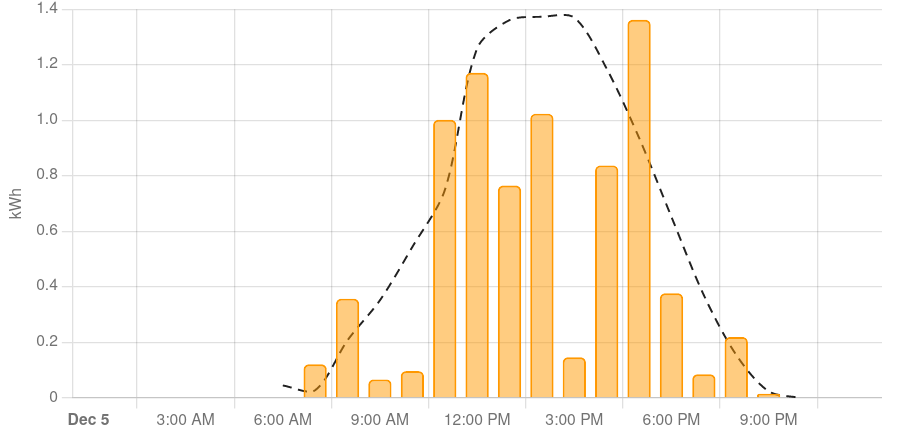

# SG1 Generacion Solar

 
:fontawesome-solid-hotel: :fontawesome-solid-solar-panel: :fontawesome-solid-fan:
 

{ width=100%}

=== ":fontawesome-solid-euro-sign: Ayudas"

    - Instalación Fotovoltaica autoconsumo: 460 - 1.188 €/kWp  (15 – 45 % ayuda sobre coste subvencionable)
    - Instalación eólica autoconsumo: 1.070 - 4.723 €/kW (20 – 50 % ayuda sobre coste subvencionable)
    - Incorporación almacenamiento autoconsumo: 200 - 700 €/kWh  (45 – 65 % ayuda sobre coste subvencionable)

=== ":fontawesome-solid-file-pdf: Estudio"
    <iframe allowfullscreen="true" 
    src="https://formulario-yzohicfcma-ew.a.run.app/Autoconsumo_Sector_Servicios" 
    width="100%" height="75%" style="border: 1px solid #fff; max-width: 1200px; min-height: 2500px" > </iframe>
    

​La potencia máxima a incentivar en las instalaciones de autoconsumo eólicas o fotovoltaicas de los Programas 1, 2 y 4 será hasta 5.000 kW.

