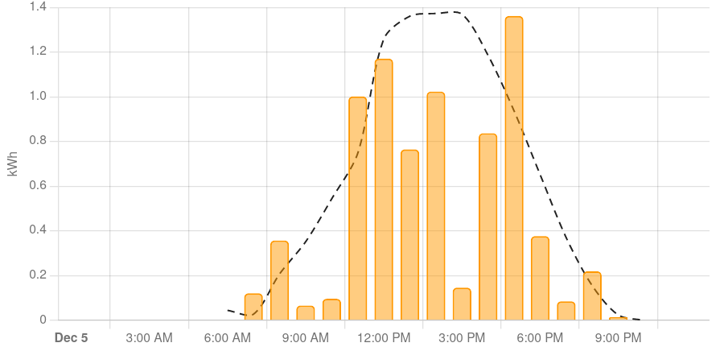
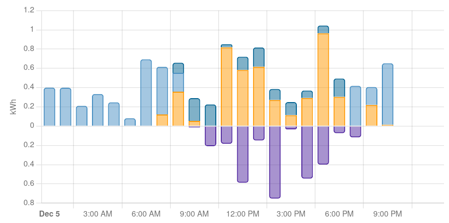

# 

    <h1 style="color:Orange;">Monitorizacion</h1>
    <!-- <h1 style="color:Orange;">Estudios</h1> -->
    <!-- <h1 style="color:Orange;">Instalaciones</h1> -->
    <!-- <h1 style="color:Orange;">Estudios, Proyectos y Dirección de obra.</h1> -->
    <h3 style="color:Orange;">
Sistemas de gestión, control activo y monitorización tanto de la generación como de la acumulación y la demanda de energía eléctrica o térmica de instalaciones consumidoras abastecidas.    
Subvencionable con las Nuevas ayudas Next Generation hasta el 70%
</h3>
[Contacto :material-email:](../Contacto){ .md-button .md-button--primary }

## Flujo de carga
Muestra de un vistazo cuánto está consumiendo, produciendo y hacia dónde se dirige esta energía. 
{ width=100%}

## Consumo de Energia
Tenga una vision general, diaria, mensual y anual, por periodos tarifarios, de su consumo 
{ width=100%}

## Consumos Parciales
Realice un seguimiento del uso de energía de cargas individuales para ver su impacto en su consumo de energía
{ width=100%}

## Generacion Solar
Es más barato consumir la energía que produce que devolverla a la red. SG te ayuda a conservar la energía que no usas para más adelante. Lo ideal es que no se vertiera nada.
{ width=100%}

## Historico
Podra programar sus cargas para optimizar el gasto.
{ width=100%}

## Uso de la energia
Tenga una vision general, diaria, mensual y anual, por periodos tarifarios, de su consumo 
{ width=100%}

<!-- cookies -->

    <h4> Aviso Cookies</h4>
     
    Este sitio web utiliza cookies para que usted tenga una mejor experiencia de usuario.
     
    Si continúa navegando está dando su consentimiento para la aceptación de las mencionadas
    cookies y la aceptación de nuestra política de cookies.
     
    Las cookies no se utilizan para recoger información de carácter personal.
    <a href="https://cookiesandyou.com/" target="_blank">Saber más</a>
    <a href="##" type="button" style="color:green;" class="btn btn-green btn-lg acceptcookies">
        Acepto
    </a>
         
     
     

